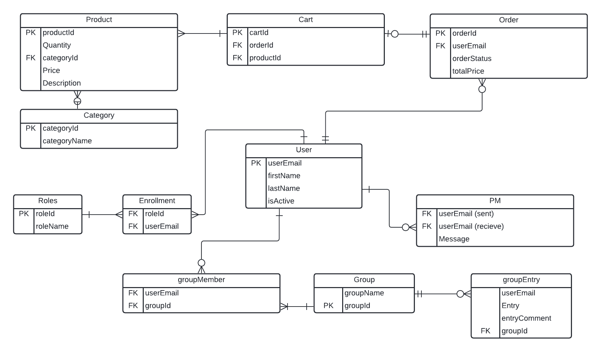
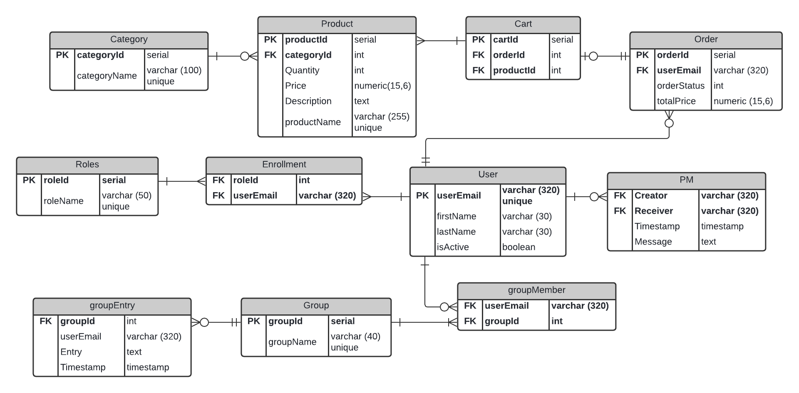

# u04a-sql-scrum  

This repo is for documentation of assignment u04a-sql-scrum.  
  
The goal of this assignment is to design and implement a SQL database in Postgres.  
In the design phase we've created a logical model and a physical model to visualise entities, attributes, relationships and constraints.  
To implement the SQL schema we've used psql (CLI) and pgadmin (GUI).  
A big part of this assignment was to learn, understand and use Scrum to manage workflows.  
___
Table of contents  

- [u04a-sql-scrum](#u04a-sql-scrum)
  - [SQLazy](#sqlazy)
  - [Agile methods](#agile-methods)
    - [Scrum](#scrum)
    - [Workflow](#workflow)
  - [SQL modelling](#sql-modelling)

___  

## SQLazy  

Participators in creating material for this assignment is:  
&nbsp;&nbsp;&nbsp;&nbsp;Tomas Karlsson  
&nbsp;&nbsp;&nbsp;&nbsp;Erik _"Ejo Was Here"_ Olsson  
&nbsp;&nbsp;&nbsp;&nbsp;Daniel _"Knapis"_ Goldmann Lapington  
&nbsp;&nbsp;&nbsp;&nbsp;Viktor _"Scissorhands"_ Berg  

## Agile methods  

### Scrum  

### Workflow  

We used Trello for managing our scrum board.  
&rarr; [Trello board](https://trello.com/b/6ckQafkt/u04)

## SQL modelling  

This is the logical and physical model we created during the first three sprints of this assignment. Models are created in Lucidchart.  
Click on one of the following images to see the corresponding model in PDF format.  

  
