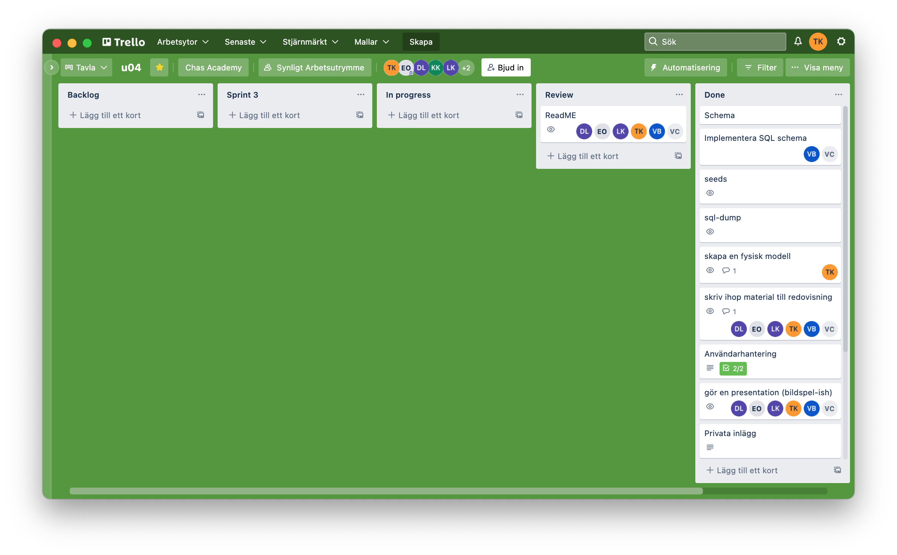
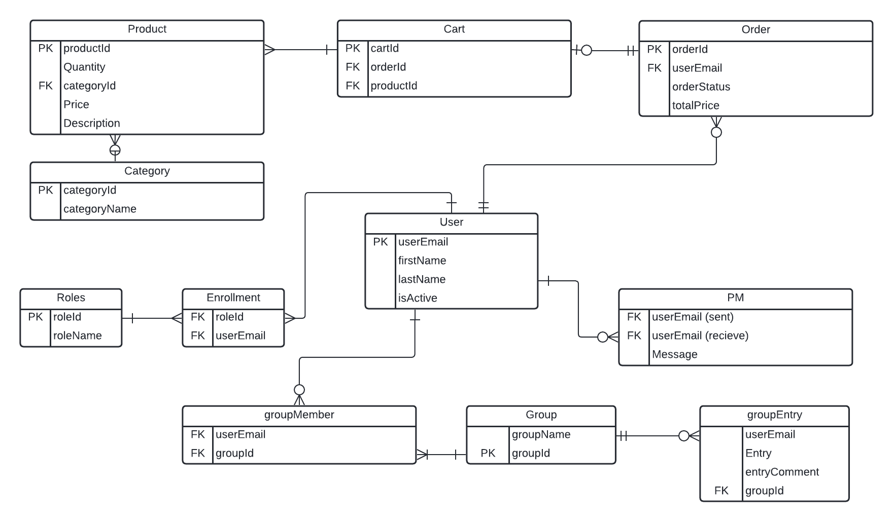
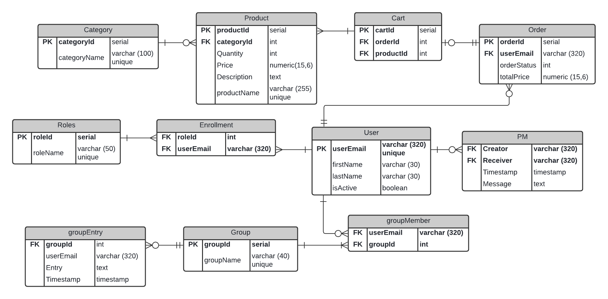
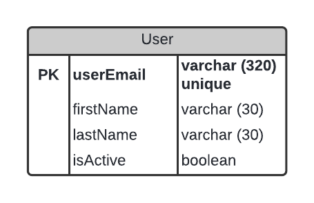
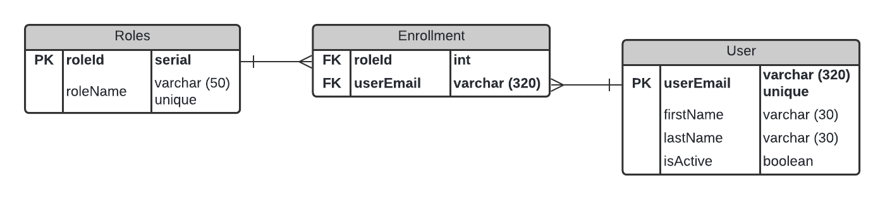

# u04a-sql-scrum  

Table of contents  

- [u04a-sql-scrum](#u04a-sql-scrum)
  - [Purpose](#purpose)
  - [SQLazy](#sqlazy)
  - [Agile methods](#agile-methods)
    - [Scrum](#scrum)
    - [Workflow](#workflow)
  - [SQL modelling](#sql-modelling)
  - [SQL usage](#sql-usage)
    - [User entity](#user-entity)
    - [User roles](#user-roles)
  - [SQL dumps](#sql-dumps)

___

This repo is for documentation of assignment u04a-sql-scrum.  
  
The goal of this assignment is to design and implement a SQL database in Postgres.  
In the design phase we've created a logical model and a physical model to visualise entities, attributes, relationships and constraints.  
To implement the SQL schema we've used psql (CLI) and pgadmin (GUI).  
A big part of this assignment was to learn, understand and use Scrum to manage workflows.  

## Purpose  

The database is going to be used by an app which has two main functions - a social media where users can connect to others directly via private messaging or through user-generated groups. The other part of the app is a webshop where users can buy products. Our focus group is homeless pet owners.  

## SQLazy  

Participators in creating material for this assignment is:  
&nbsp;&nbsp;&nbsp;&nbsp;Tomas Karlsson  
&nbsp;&nbsp;&nbsp;&nbsp;Erik _"Ejo Was Here"_ Olsson  
&nbsp;&nbsp;&nbsp;&nbsp;Daniel _"Knapis"_ Goldmann Lapington  
&nbsp;&nbsp;&nbsp;&nbsp;Viktor _"Scissorhands"_ Berg  

## Agile methods  

A big part of this assignment was to get to know and use Scrum as a method for Agile development.  

### Scrum  

We've read some litterature about the basic principles of Scrum and Kanban. It has been totally new for us so the usage of Scrum has been learnt mostly by trial-and-error. The Scrum master role has rotated so each participant has got the oppurtunity to understand it better.  

### Workflow  

We used Trello for managing our scrum board.  
  
&rarr; [Trello board](https://trello.com/b/6ckQafkt/u04)  

## SQL modelling  

This is the logical and physical model we created during the first three sprints of this assignment. Models are created in Lucidchart.  
Click on one of the following images to see the corresponding model in PDF format.  

  

## SQL usage  

We'll guide you through the most central parts of the database and start with what is most important for us - our users.  

### User entity  

  
The attribute _userEmail_ serves as an identifier for each user and is the _primary key_ for this entity. It's data type is _varchar_ and has a maximum character length of 320 characters including "@" and its domain. Because of userEmail's funtion as an identifier for our users it as to be _unique_.  
The following twwo attributes - firstName and lastname are quite self explanatory. These are mandatory and should be set to _NOT NULL_.  
The last attribute - isActive - is a boolean marker that should be set to _true_ by default. If a user misbehaves or wants to stop using this app we can set it to _false_. The user will still exist in our database but he or she will not be visible for other users, except admin.  

### User roles  

  

Every user can be assigned to several _roles_. Due to this being a many-to-many relationship (one user can have many roles and one role can be assigned to many users) we've added a junction table called _Enrollment_ with foreign keys that relates to the the attribute _userEmail_ in the entity _User_ and the attribute _roleId_ in the entity _Roles_.  
That means that specific roles should be added to the entity _Roles_ and a specific role is assigned to a specific user in the entity _Enrollment_.  

___

## SQL dumps  

Database dumps are located [here](sql_dumps/).
